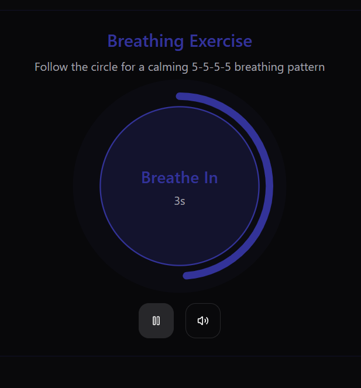
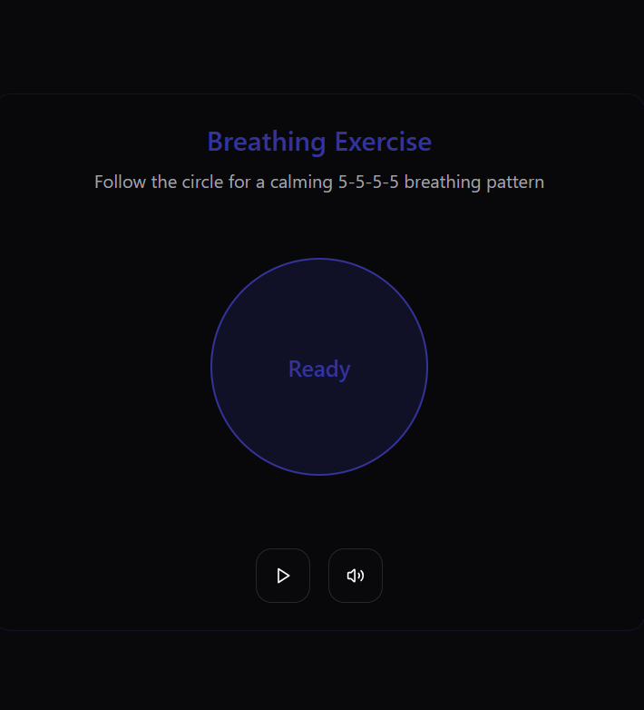
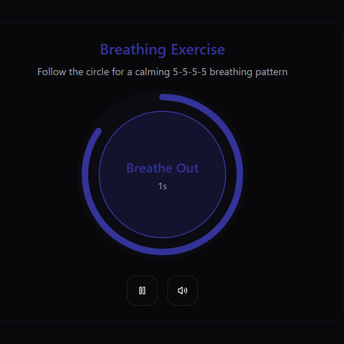

# 555 Breathing App

A guided breathing exercise web application designed to help users practice the **5-5-5-5 breathing pattern**, promoting relaxation and mindfulness.

## 🧘‍♂️ What is 555 Breathing?
The **5-5-5-5 breathing technique** involves:
1. **Inhaling** for **5 seconds**
2. **Holding** for **5 seconds**
3. **Exhaling** for **5 seconds**
4. **Holding** for **5 seconds**

This method helps regulate breathing, reduce stress, and enhance mental clarity.

## 🚀 Features
- **Animated Breathing Circle** 🎬 - Follow a smooth visual guide.
- **Audio Cues** 🔊 - Enable sound for better focus.
- **Minimal UI** 🎨 - Dark theme for a calming experience.
- **Simple Controls** 🎛️ - Play/Pause and adjust sound easily.

## 📸 Screenshots
| Breathing In | Ready State | Breathing Out |
|-------------|-------------|--------------|
|  |  |  |

## 🛠️ Tech Stack
### **Frontend**
- **React (TypeScript)** - Component-based UI development.
- **Vite** - Fast build and development setup.
- **Tailwind CSS** - Styling framework for responsive design.
- **PostCSS** - Enhancing CSS processing.

### **Backend**
- **Express.js (Node.js)** - Lightweight server setup.

### **State Management & Logic**
- **Custom Hooks (use-breathing.ts & use-sound.ts)** - Manages breathing logic and sound settings.

## 📂 Project Structure

```perl
555/
├── client/
│   ├── src/
│   │   ├── components/
│   │   │   ├── breathing-circle.tsx        # Main animation component
│   │   │   └── breathing-controls.tsx      # Play/pause and sound controls
│   │   ├── lib/
│   │   │   ├── use-breathing.ts           # Breathing logic
│   │   │   └── use-sound.ts               # Sound management
│   │   ├── pages/
│   │   │   └── home.tsx                   # Main page
│   │   ├── App.tsx                        # Main app component
│   │   ├── index.css                      # Global styles
│   │   └── main.tsx                       # Entry point
│   └── index.html                         # HTML template
├── package.json                           # Dependencies
├── tsconfig.json                          # TypeScript config
├── vite.config.ts                         # Vite config
├── postcss.config.js                      # PostCSS config
├── tailwind.config.ts                     # Tailwind config
└── theme.json                             # Theme settings
```

## 🏗️ How to Run Locally

### 1️⃣ Clone the Repository
```sh
git clone https://github.com/sehajbirsingh/555-Breathing.git
cd 555-Breathing
```
### 2️⃣ Install Dependencies
```bash
npm install
```
### 3️⃣ Start Development Server
```sh
npm run dev
```
The app will be available at http://localhost:5000

## 📌 Benefits of 555 Breathing
```sh
- Reduces Anxiety 🧘‍♀️ - Helps calm the nervous system.
- Improves Focus 🎯 - Enhances concentration and mindfulness.
- Regulates Heart Rate ❤️ - Supports cardiovascular health.
- Enhances Sleep Quality 😴 - Prepares the body for rest.
```

## 🌟 Contributing
```sh
Feel free to fork the repository and make contributions.
```

## 📜 License
```
This project is open-source and available under the MIT License.
```


